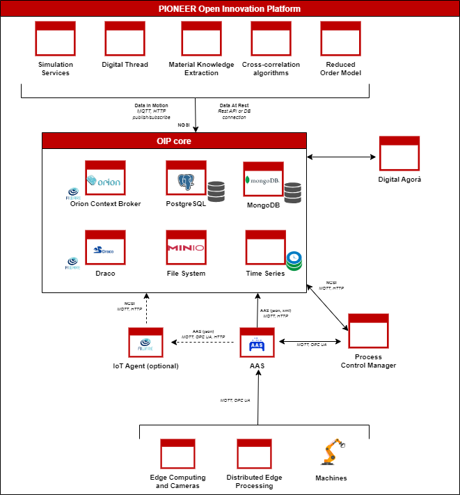

<h1>Open Innovation Platform</h1>

https://www.pioneer-project.eu/

 

Open Innovation Platform for optimising production systems by combining product development, virtual engineering workflows and production data.

<h2>Requirements</h2>
<ul>
    <li>Docker Engine</li>
    <li>Minimum 8GB RAM</li>
    <li>Docker Compose >= 1.29</li>
</ul>

 

<h2>How to run</h2>
<h3>Build & Run containers:</h3>

<code>docker-compose up --build -d</code>

 

<h3>Access the UIs</h3>

1. Draco at (https://localhost:8443/nifi)

 

<h2>Configuration</h2>

In Draco you can configure your own data flow (see NiFi doc <a  href="https://nifi.apache.org/docs/nifi-docs/html/getting-started.html">here</a>).
The solution provides processing on Draco or Spark. Algorithms & data ingestion can be done by calling the provided APIs.
Inside the template pre-loaded on Draco you can activate the flows you prefer to use and can configure each Draco processor following the notes on the UI.

<h4>Draco/Draco credentials</h4>
<table>
<tr>
<th>User</th>
<th>Password</th>
</tr>
<tr>
<td>admin</td>
<td>ctsBtRBKHRAx69EqUghvvgEvjnaLjFEB</td>
</tr>
</table>

Draco will start with pre-uploaded template:

- [template.xml](conf/draco/templates/template.xml)

 
