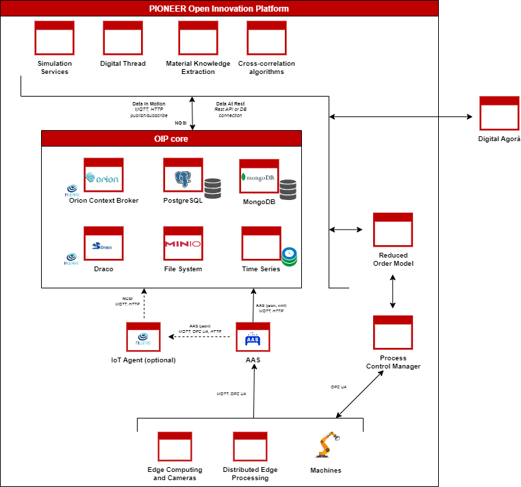

<h1>Open Innovation Platform</h1>


https://www.pioneer-project.eu/

<br>

Open Innovation Platform for optimising production systems by combining product development, virtual engineering workflows and production data.




<h2>Requirements</h2>
<ul>
    <li>Docker Engine</li>
    <li>Minimum 8GB RAM</li>
    <li>Docker Compose >= 2.27.1</li>
    <li>OpenSSL >=3.4.0</li>
</ul>

<h2>How to run</h2>
<h3>Preliminary information</h3>
The repository comes with different services available depending on the use-case needs. The first option is to run the overall platform by running
<code>docker compose up --build -d</code>.

As alternative, services in the OIP are grouped in profiles as showed below. Just run the profiles needed for the use-case.
<table>
    <tr>
        <th>Profile</th>
        <th>Services</th>
        <th>Mandatory</th>
    </tr>
    <tr>
        <td>oip-core</td>
        <td>Orion, Draco, MinIO, MongoDB, PostgreSQL, Mosquitto</td>
        <td>YES</td>
    </tr>
    <tr>
        <td>oip-sec</td>
        <td>Keycloak, API Gateway (Traefik), OAuth2-Proxy</td>
        <td>NO</td>
    </tr>
    <tr>
        <td>oip-connector-json</td>
        <td>IoT Agent JSON, IoT Agent UI</td>
        <td>NO</td>
    </tr>
   <tr>
        <td>oip-connector-opcua</td>
        <td>IoT Agent OPC UA, IoT Agent UI</td>
        <td>NO</td>
    </tr>
    <tr>
        <td>oip-connector-aas</td>
        <td>IoT Agent AAS, IoT Agent UI</td>
        <td>NO</td>
    </tr>
    <tr>
        <td>oip-connector-aas-proxy</td>
        <td>IoT Agent AAS Proxy</td>
        <td>NO</td>
    </tr>
    <tr>
        <td>oip-visualization</td>
        <td>Grafana</td>
        <td>NO</td>
    </tr>
</table>

First of all you need to configure you first level domain in all config files (search for "pioneer-project.eu" and replace with your own).

In order to use HTTPS, you need to generate SSL certificates using the provided script `generate_ssl_certificates.sh` or use your own certificates. Certificates must be copied into `config/traefik/certs` folder named `fullchain.pem` and `privkey.pem`. To use HTTPS, the profile `oip-sec` is mandatory.

For a local deployment you need to map subdomains into the `hosts` file of your machine, like this:

```
127.0.0.1 oauth2-proxy.pioneer-project.eu
127.0.0.1 keycloak.pioneer-project.eu
127.0.0.1 draco.pioneer-project.eu
127.0.0.1 orion.pioneer-project.eu
127.0.0.1 minio.pioneer-project.eu
127.0.0.1 grafana.pioneer-project.eu
127.0.0.1 iotagent-ui.pioneer-project.eu
```

Using the `oip-sec` all the user interfaces and APIs are protected using oauth2-proxy and keycloak; configure keycloak as you prefer to manage the users.

<h3>How to build & run</h3>

1. Replace `pioneer-project.eu` in the whole project with your own domain.
2. Generate certificates by running `./generate_ssl_certificates.sh yourdomain.com` (Linux) or `.\generate_ssl_certificates.ps1 yourdomain.com` (Windows) or provide yours as explained in the previous paragraph.
3. Run you preferred profiles by the provided script: `./start.sh <list of profiles>`. For example `./start.sh oip-core oip-sec  oip-visualization`


<h3>Access the UIs</h3>

1. Draco at https://draco.pioneer-project.eu
2. IotAgent UI at https://iotagent-ui.pioneer-project.eu
3. Keycloak at https://keycloak.pioneer-project.eu
4. Grafana at https://grafana.pioneer-project.eu
5. MinIO Console at https://minio.pioneer-project.eu

Default credentials for each UI are listed below:

<table>
<tr>
    <th>Application</th>
    <th>User</th>
    <th>Password</th>
</tr>
<tr>
    <td>Draco</td>
    <td>admin</td>
    <td>ctsBtRBKHRAx69EqUghvvgEvjnaLjFEB</td>
</tr>
<tr>
    <td>IotAgent UI</td>
    <td>admin</td>
    <td>admin</td>
</tr>
<tr>
    <td>Keycloak</td>
    <td>admin</td>
    <td>admin</td>
</tr>
<tr>
    <td>Grafana</td>
    <td>admin</td>
    <td>admin</td>
</tr>
<tr>
    <td>MinIO Console</td>
    <td>minioadmin</td>
    <td>minioadmin</td>
</tr>
</table>

<h2>Configuration</h2>
All the services into the OIP can be configured by editing files into the "conf" folder from the root of the project.

<h4>Draco</h4>
The component provides data flows based on Rest HTTP or MQTT.

In Draco you can configure your own data flow (see NiFi doc <a  href="https://nifi.apache.org/docs/nifi-docs/html/getting-started.html">here</a>), by accessing the UI.
Inside the template pre-loaded on Draco you can activate the flows you prefer to use and can configure each Draco processor following the notes on the UI.
Draco will start with pre-uploaded [OpenInnovationPlatform](conf/draco/templates/OpenInnovationPlatform.xml) template.

<h4>IotAgent UI</h4>
The component provide user-friendly interface to configure and handle IoT Agents.

<h4>Keycloak</h4>
The component provides Identity & Access Management functionalities.
Every role, user, client, etc. can be configured by the dedicated user interface.

The repository provides some pre-configured [realms](conf/keycloak/realms) and [clients](conf/keycloak/clients) that are imported in Keycloak at the first startup.

<h4>Grafana</h4>
The component provides visualization functionalities and allows to build dashboards. It can be configured directly within the provided user interface.

<h4>MinIO Console</h4>
The component provides obejct storage functionalities.
It comes up with a pre-configured environment [file](conf/minio/minio.env).
